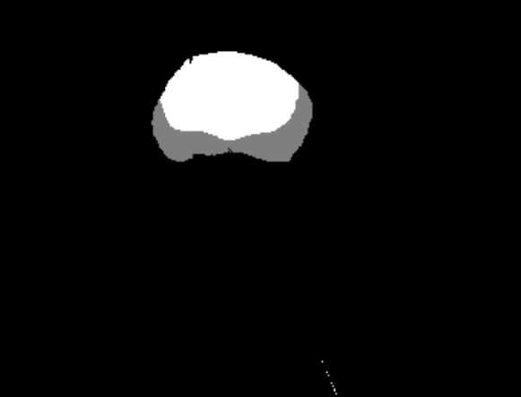
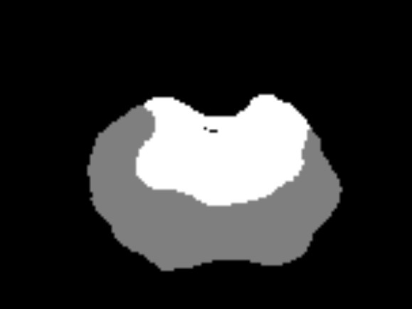
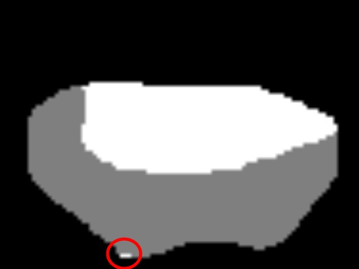

# ProstateSeg_QC


ProstateSeg_QC is a quality control algorithm to fix prostate zone segmentation masks. It finds and rectifies common errors that occur during manual segmentation.

## Method

This is an all-in-one algorithm to process the entire dataset. It is largely based on finding and analyzing connected components.

The algorithm requires separate files for the whole prostate mask, the peripheral zone mask and the non-peripheral (central) zone mask. Here is what it does:
- Finds and removes all small connected components from all the masks.




- Finds and patches all small holes in the masks.




- Finds snippets that are labeled as central zone but were very clearly just small errors when marking the peripheral zone mask onto the whole prostate mask. It converts those to peripheral zone.




- Checks if the whole mask equals the sum of the peripheral and central zone masks. If not, it replaces the whole mask.


## Requirements

The program requires these modules to be installed:

- numpy
- pandas
- SimpleITK
- connected-components-3d
- tqdm
- regex

## Installation
`pip install prostate_seg_qc`


## Usage
To do quality control on zone masks:
```python
from pqc.qc import qc_zone, qc_lesion

# To do quality control on zone masks
qc_zone(COMBINED_PATH='path/to/combined/mask/directory')

# To do quality control on lesion masks
qc_lesion(LESION_PATH='path/to/lesion/mask/directory')
```


By default the program saves only the masks that were changed, saving them into new directories that are created in the cwd. It also creates .csv files that store the information on all the errors that were found.


## Contributing
Pull requests are welcome. For major changes, please open an issue first to discuss what you would like to change.
