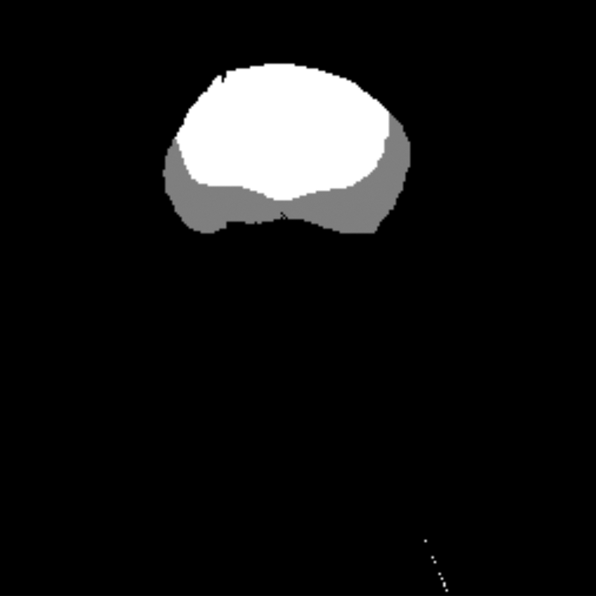
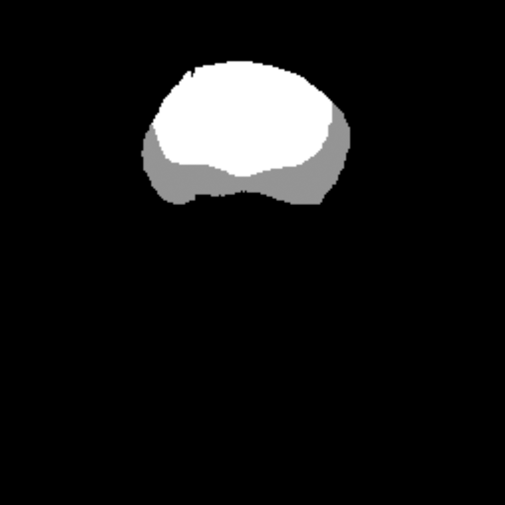
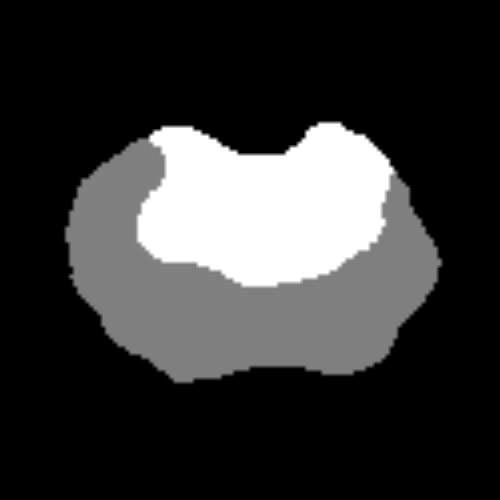
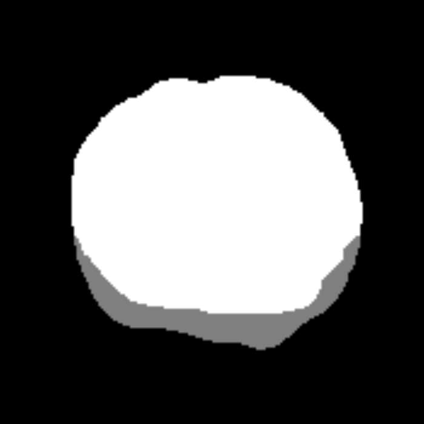

# ProstateSeg_QC


ProstateSeg_QC is a quality control algorithm to fix prostate zone and lesion segmentation masks. It finds and rectifies common errors that occur during manual segmentation.

## What it does

This is an all-in-one algorithm to process the entire dataset. It is largely based on finding and analyzing connected components.

QC of zone segmentation masks:

1. Finds and removes all small connected components from all the masks.
2. Finds and patches all small holes in the masks.
3. Finds snippets that are labeled as central zone but were very clearly just small errors when marking the peripheral zone mask onto the whole prostate mask. It converts those to peripheral zone.
4. Checks if the whole mask equals the sum of the peripheral and central zone masks. If not, it replaces the whole mask. (optional)

QC of lesion segmentation masks:
1. Finds and removes all small connected components from all the masks.
2. Finds and patches all small holes in the masks.

## Examples

<p align="center"> Filtering small components </p>

<p align="center">   
</p>


<p align="center"> Patching holes </p>
<p align="center">  
</p>

<p align="center">Fixing snippets</p>
 <p align="center">  
</p>

## Requirements

The program requires these modules to be installed:

- numpy
- pandas
- SimpleITK
- connected-components-3d
- tqdm
- regex

## Installation
Comming soon:
`pip install prostate_seg_qc`

For now clone the repository, navigate to the folder where the clone resides and run: `pip install -e .`

## Usage
```python
from psqc import qc_zone, qc_lesion

# To do quality control on zone masks
qc_zone(combined_path='path/to/combined/mask/directory')

# To do quality control on lesion masks
qc_lesion(lesion_path='path/to/lesion/mask/directory')
```


By default the program saves only the masks that were changed, saving them into new directories that are created in the cwd. This can all be changed by passing appropriate arguments into the respective functions. It also creates .csv files that store the information on all the errors that were found.

## Contributing
Pull requests are welcome. For major changes, please open an issue first to discuss what you would like to change.

## Acknowledgements
The method was developed at the CIMORe group at the Norwegian University of Science and Technology (NTNU) in Trondheim, Norway. https://www.ntnu.edu/isb/cimore